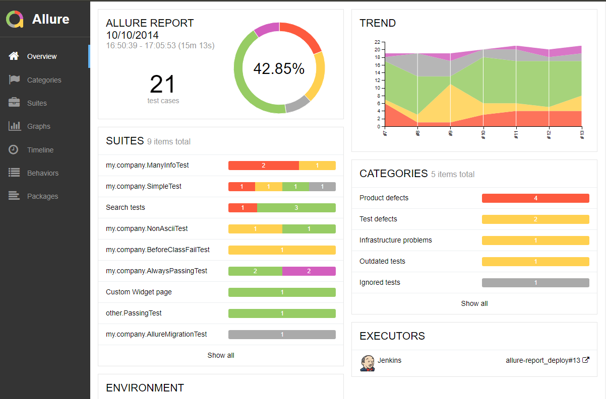
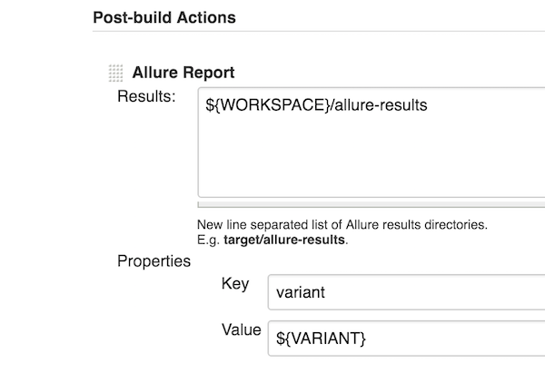
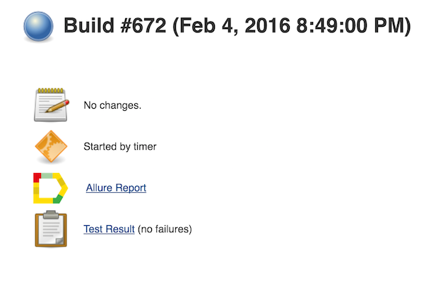
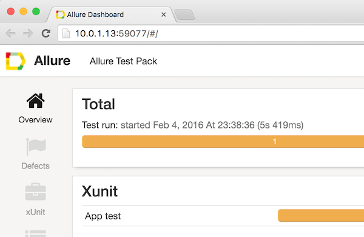

WDIO Allure Reporter [](https://travis-ci.org/webdriverio/wdio-allure-reporter) [](https://codeclimate.com/github/webdriverio/wdio-allure-reporter)
====================

> A WebdriverIO reporter plugin to create [Allure Test Reports](https://docs.qameta.io/allure/).



## Installation

The easiest way is to keep `wdio-allure-reporter` as a devDependency in your `package.json`.

```json
{
  "devDependencies": {
    "wdio-allure-reporter": "~0.5.0"
  }
}
```

You can simple do it by:

```bash
npm install wdio-allure-reporter --save-dev
```

Instructions on how to install `WebdriverIO` can be found [here](http://webdriver.io/guide/getstarted/install.html).

## Configuration
Configure the output directory in your wdio.conf.js file:

```js
exports.config = {
    // ...
    reporters: ['allure'],
    reporterOptions: {
        allure: {
            outputDir: 'allure-results',
            disableWebdriverStepsReporting: true,
            useCucumberStepReporter: false
        }
    },
  // ...
}
```

- `outputDir` defaults to `./allure-results`. After a test run is complete, you will find that this directory has been populated with an `.xml` file for each spec, plus a number of `.txt` and `.png` files and other attachments.
- `disableWebdriverStepsReporting` - optional parameter(false by default), in order to log only custom steps to the reporter.
- `useCucumberStepReporter` - optional parameter(false by default), use this if you want to report Cucumber scenario steps as allure steps(instead of tests) in your report. DON'T use with mocha or jasmine - results will be unpredictable.

## Supported Allure API
* `feature(featureName)` – assign feature to test
* `story(storyName)` – assign user story to test
* `addEnvironment(name, value)` – save environment value
* `createAttachment(name, content, [type])` – save attachment to test.
    * `name` (*String*) - attachment name.
    * `content` – attachment content.
    * `type` (*String*, optional) – attachment MIME-type, `text/plain` by default
* `addDescription(description, [type])` – add description to test.
    * `description` (*String*) - description of the test.
    * `type` (*String*, optional) – description type, `text` by default. Values ['text', 'html','markdown']
* `createStep(title, body, [bodyLabel])` - add step to test.
    * `title` (*String*) - name of the step.
    * `body` (*String*) - body of the step appear as attachment under step
    * `bodyLabel` (*String*, optional) - body label, `attachment` by default.
    * `status` (*String*, optional, default 'passed') - step status. Must be "failed", "passed" or "broken"
### Usage
Allure Api can be accessed using:
ES5
```js
const reporter = require('wdio-allure-reporter')
```
ES6
```js
import reporter from 'wdio-allure-reporter'
```
Mocha example
```js
describe('Suite', () => {
    it('Case', () => {
        reporter.feature('Feature')
    })
})
```

## Displaying the report
The results can be consumed by any of the [reporting tools](https://docs.qameta.io/allure#_reporting) offered by Allure. For example:

### Jenkins
Install the [Allure Jenkins plugin](https://docs.qameta.io/allure#_jenkins), and configure it to read from the correct directory:


Jenkins will then offer a link to the results from the build status page:


If you open a report at the first time you probably will notice that Jenkins won't serve the assets due to security restrictions. If that is the case go to Jenkins script console (`http://<your_jenkins_instance>/script`) and put in these security settings:

```
System.setProperty("hudson.model.DirectoryBrowserSupport.CSP", "default-src 'self'; script-src 'self' 'unsafe-inline' 'unsafe-eval'; style-src 'self' 'unsafe-inline';")
System.setProperty("jenkins.model.DirectoryBrowserSupport.CSP", "default-src 'self'; script-src 'self' 'unsafe-inline' 'unsafe-eval'; style-src 'self' 'unsafe-inline';")
```

Apply and restart the Jenkins server. All assets should now be served correctly.

### Command-line
Install the [Allure command-line tool](https://www.npmjs.com/package/allure-commandline), and process the results directory:
```bash
allure generate [allure_output_dir] && allure open
```
This will generate a report (by default in `./allure-report`), and open it in your browser:


### Add Screenshots
Screenshots can be attached to the report by using the `saveScreenshot` function from WebDriverIO in afterStep hook.
```js
//...
var name = 'ERROR-chrome-' + Date.now()
browser.saveScreenshot('./errorShots/' + name + '.png')
//...
```
As shown in the example above, when this function is called, a screenshot image will be created and saved in the directory, as well as attached to the allure report.

----

For more information on WebdriverIO see the [homepage](http://webdriver.io).

## Development

### Integration Tests
Integration Tests are running webdriverio multiple times using the wdio-allure-reporter and verifying the output.

Run tests:
```
npm test
```
## Displaying the report
 To generate Allure report run
  ```
 npm run report
  ```
 This will generate a report (by default in ./allure-report), and open it in your browser

 Because before each test ./.alure-result folder is cleaned, so you should generate report only for one test by setting it in ./test/mocha.opts
